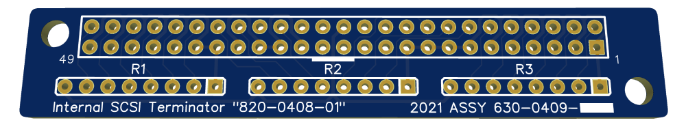
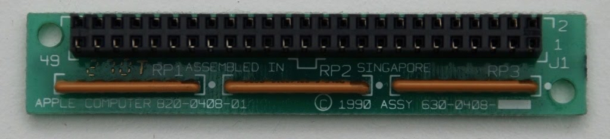
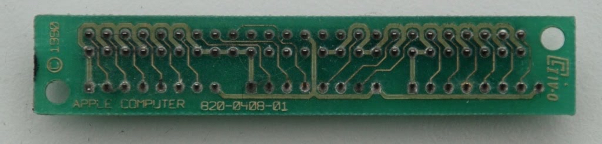

# Internal-SCSI-Terminator 
A 50-pin internal SCSI terminator based on Apple's `820-0408-01`

# Ordering
Either download the [Gerber file](/Gerbers) and submit it to your favorite manufacturer or order directly through JLCPCB with this [Open Hardware link](https://oshwlab.com/stephenarsenault/apple-820-0408-01-internal-scsi-terminator). The EasyEDA source JSON file is also available in the Gerbers folder.

# BOM
 1. 1x 50pin 2x25 2.54mm Pitch Female Header ([Mouser](https://www.mouser.com/ProductDetail/3M-Electronic-Solutions-Division/929975-01-25-RK?qs=4V84emjyG36i%2FNBH2jFhRw%3D%3D)) ([Digikey](https://www.digikey.com/en/products/detail/sullins-connector-solutions/SFH11-PBPC-D25-ST-BK/1990094))
 2. 3x Dual Terminator 220/330ohm Resistor Pack ([Mouser](https://www.mouser.com/ProductDetail/Bourns/4608X-104-221-331L?qs=Jmdaixpf9V11ghc0uvvu1g%3D%3D)) ([Digikey](https://www.digikey.com/en/products/detail/bourns-inc/4608X-104-221-331L/1089163))

# License
All content in this repo are licensed under CC BY 4.0 ([License](LICENSE.md)) ([Creative Commons](https://creativecommons.org/licenses/by/4.0/)).

# Images

<i>Images generously provided by Mr. Fahrenheit of <a href="https://68kmla.org/bb/index.php?threads/will-this-scsi-terminator-work-plugged-into-the-logic-board.39681/">68KMLA.org</a> / TinkerDifferent.com</i>
